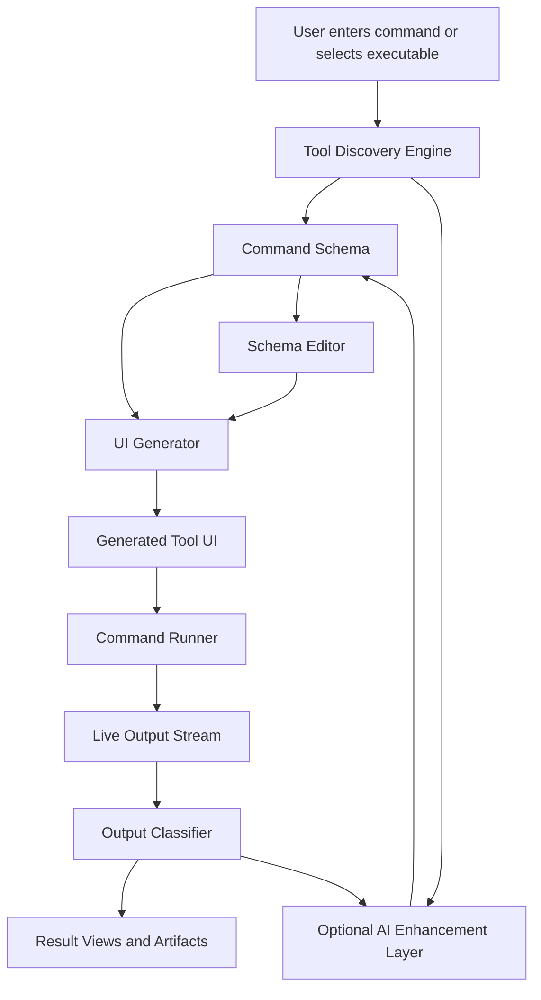

# GIVEMEUI Production Roadmap

This file is the canonical build prompt for GIVEMEUI.

GIVEMEUI is a locally installed command-line companion that converts terminal applications, shell commands, and CLI tools into usable graphical interfaces. It should work without AI through deterministic command introspection, and it may optionally use local or cloud AI providers to improve command understanding, output interpretation, and UI generation.

The product should feel like an extension of the terminal, not a replacement for it. Its purpose is to help users run command-line tools faster by reducing flag memorization, making option selection structured, preserving exact command previews, and saving repeatable workflows.

The production product must not depend on cloud AI. AI is an enhancement layer, not the foundation.

## Product Definition

### Core Goal

Build a production-grade locally installed CLI tool that lets a user point GIVEMEUI at a terminal command and receive a local desktop UI for configuring, running, monitoring, and understanding that command. The UI should act like a practical control panel for the underlying CLI, similar in spirit to how Wireshark gives users a structured interface around packet-capture workflows.

The UI should turn this:

```bash
ffmpeg -i input.mov -vf scale=1280:-1 -c:v libx264 -crf 22 output.mp4
```

Into a structured interface with:

- A selected tool profile.
- Inputs for files, flags, options, presets, and arguments.
- Validation before execution.
- A safe command preview.
- A run button.
- Live stdout/stderr output.
- Exit status and timing.
- Artifacts and result previews when possible.
- Saved configurations and repeatable workflows.

The user should never lose sight of the command being run. Advanced users should be able to treat GIVEMEUI as a faster command-composition surface while still trusting the exact executable and arguments.

### Product Principles

- Local-first by default.
- No cloud dependency for core functionality.
- Deterministic parsing before AI inference.
- Command-line extension, not terminal replacement.
- Optimize for Linux/macOS command-line workflows first.
- Human-editable schemas.
- Safe command execution with clear previews.
- Generated UIs must be useful immediately, not decorative mockups.
- Advanced users must be able to inspect, edit, export, and version the generated schema.
- The app must handle messy real-world CLIs, not only perfect examples.

### Target Users

- Developers who want quick UIs for internal scripts.
- Linux, Kali Linux, and macOS users who want UI assistance for command-heavy tools.
- DevOps engineers who want safer wrappers around operational commands.
- Security practitioners wrapping tools they are authorized to run locally.
- Data scientists who want forms around Python/R/shell tools.
- Creators who use tools like `ffmpeg`, `yt-dlp`, `imagemagick`, or `whisper`.
- Teams that want repeatable GUI workflows without building custom apps.

### Non-Goals For V1

- Do not try to support every interactive TUI application perfectly.
- Do not build a general app builder.
- Do not require a hosted backend.
- Do not target mobile operating systems for V1.
- Do not require OpenAI or any cloud provider.
- Do not execute untrusted remote commands without explicit user consent.
- Do not hide the underlying command from advanced users.
- Do not provide attack playbooks or unauthorized target guidance for dual-use tools.
- Do not ship presets that imply credential attacks, unauthorized scanning, or destructive operations.

### Initial Platform Focus

- Debian and Debian-based Linux.
- Kali Linux.
- macOS.
- Unix-like shells and `$PATH` resolution.

Windows support can come later, but V1 should be excellent for local Linux/macOS terminal workflows.

## Recommended Technical Direction

### App Shape

Start with a local CLI package that serves a desktop local UI:

- Frontend: React + Vite + TypeScript.
- Desktop wrapper: Tauri preferred for production local execution, Electron acceptable if the repo already depends on it.
- Backend/runtime: Rust if using Tauri commands, or Node.js if using Electron/local server.
- Schema format: JSON Schema-compatible internal command schema.
- Local data: SQLite for saved tools, command runs, presets, and generated schemas.
- Command execution: isolated process runner with argument-array execution, PTY support where needed, and no shell string execution by default.

### Why This Shape

React + Vite gives fast local UI development. Tauri gives native filesystem/process access with a smaller footprint than Electron. SQLite keeps the app local and portable. A schema-first model allows deterministic parsers, local AI, cloud AI, and manual editing to all write to the same intermediate representation.

## Core Architecture



### Main Modules

- `discovery`: Finds executable metadata, help output, subcommands, flags, defaults, choices, and examples.
- `schema`: Defines the durable command/UI schema.
- `runner`: Executes commands safely and streams output.
- `ui-generator`: Maps schema fields to UI components.
- `output`: Parses logs, tables, JSON, files, images, and artifacts.
- `ai`: Optional provider-neutral enhancement layer.
- `storage`: Persists tools, schemas, presets, runs, and user settings.
- `security`: Handles trust prompts, path validation, command restrictions, and secret handling.
- `desktop`: Native shell integration, filesystem access, and packaging.

### Design Analogy

GIVEMEUI should do for command-line tools what Wireshark-style interfaces do for packet analysis workflows: expose power through a structured interface without hiding the underlying operation from expert users.

## Command Schema

The command schema is the core product asset. Everything should revolve around it.

### Required Concepts

```ts
type ToolManifest = {
  id: string;
  name: string;
  description?: string;
  executable: string;
  version?: string;
  source: "detected" | "imported" | "manual" | "ai-enhanced";
  commands: CommandSpec[];
  createdAt: string;
  updatedAt: string;
};

type CommandSpec = {
  id: string;
  name: string;
  description?: string;
  subcommand?: string[];
  fields: FieldSpec[];
  examples?: CommandExample[];
  output?: OutputSpec;
  safety?: SafetySpec;
};

type FieldSpec = {
  id: string;
  label: string;
  description?: string;
  kind:
    | "string"
    | "number"
    | "boolean"
    | "enum"
    | "file"
    | "directory"
    | "multi-file"
    | "secret"
    | "array"
    | "raw";
  required: boolean;
  position?: number;
  flag?: string;
  shortFlag?: string;
  defaultValue?: unknown;
  choices?: string[];
  placeholder?: string;
  validation?: FieldValidation;
  ui?: FieldUiHints;
};
```

### Schema Rules

- Store commands as executable plus argument arrays, not interpolated shell strings.
- Preserve raw detected help output for auditability.
- Keep generated labels and descriptions editable.
- Support subcommands as first-class objects.
- Support positional arguments separately from flags.
- Support repeated flags and variadic positional args.
- Support presets as saved field values against a command schema version.
- Version schemas so changes do not break old saved runs.

## Roadmap Phases

## Phase 0: Product Groundwork

### Objectives

- Define exact V1 workflows.
- Choose the app stack.
- Define the command schema.
- Establish the security model before command execution exists.

### Tasks

1. Create the repository structure.
2. Select Tauri + React + Vite + TypeScript unless there is a strong reason not to.
3. Add linting, formatting, type checking, and test tooling.
4. Define `ToolManifest`, `CommandSpec`, `FieldSpec`, `RunRequest`, and `RunResult`.
5. Write schema fixtures for representative CLIs:
   - `ffmpeg`
   - `yt-dlp`
   - `git`
   - `python script.py --help`
   - `docker`
   - A small custom script with `argparse`
6. Document trusted versus untrusted commands.
7. Document how command preview, validation, and execution confirmation should work.

### Exit Criteria

- The app skeleton runs locally.
- The schema package has tests.
- Fixture schemas exist.
- There is a written threat model.

### Phase 0 Status

Phase 0 is complete for the open-source baseline. The implemented artifacts are tracked in [docs/PHASE_0_GROUNDWORK.md](./docs/PHASE_0_GROUNDWORK.md), with V1 workflows in [docs/V1_WORKFLOWS.md](./docs/V1_WORKFLOWS.md), the production threat model in [docs/THREAT_MODEL.md](./docs/THREAT_MODEL.md), and parser fixtures in `tests/fixtures/help/`.

The next production step is Phase 1: deterministic CLI discovery.

## Phase 1: Deterministic CLI Discovery

### Objectives

Extract useful metadata from terminal tools without AI.

### Detection Strategy

Try these in order:

1. Known adapter for the executable.
2. Structured metadata command if available.
3. Framework-specific detection.
4. Generic `--help` parsing.
5. Manual schema creation fallback.

### Supported Sources

- `--help`
- `-h`
- `help`
- `man`
- JSON metadata when available
- Python `argparse` help text
- Python `click` and `typer`
- Node `commander` and `yargs`
- Go `cobra`
- Rust `clap`

### Tasks

1. Build executable resolution:
   - Absolute path.
   - `$PATH` lookup.
   - Project-local scripts.
2. Capture command version:
   - `--version`
   - `version`
   - adapter-specific version commands.
3. Implement help output capture with timeout and no shell interpolation.
4. Implement generic parser for:
   - Short flags.
   - Long flags.
   - Flags with values.
   - Boolean switches.
   - Positional arguments.
   - Required versus optional hints.
   - Defaults.
   - Choices.
   - Subcommands.
5. Preserve confidence scores for detected fields.
6. Render low-confidence fields as editable review items.
7. Add tests using fixed help-output snapshots.

### Exit Criteria

- A user can enter a command and get a usable first-pass schema.
- The parser works on at least five real-world CLI fixtures.
- Low-confidence parsing is visible and editable.

### Phase 1 Status

Phase 1 is complete for the open-source baseline. The implemented artifact is tracked in [docs/PHASE_1_DISCOVERY.md](./docs/PHASE_1_DISCOVERY.md).

The next production step is Phase 2: schema review and editing.

## Phase 2: Schema Review And Editing

### Objectives

Make generated schemas trustworthy by letting users inspect and correct them.

### UI Requirements

- Tool overview.
- Command list.
- Field table.
- Field detail editor.
- Raw help output viewer.
- Schema JSON viewer.
- Confidence indicators.
- Save and discard controls.

### Tasks

1. Build a schema review screen.
2. Allow users to edit:
   - Labels.
   - Descriptions.
   - Required state.
   - Field type.
   - Defaults.
   - Choices.
   - Validation.
   - UI hints.
3. Allow users to hide advanced fields.
4. Allow users to group fields into sections.
5. Add schema import/export as JSON.
6. Add schema versioning.

### Exit Criteria

- A generated schema can be corrected without editing files manually.
- Exported schema can be re-imported.
- Invalid schemas show actionable validation errors.

### Phase 2 Status

Phase 2 is complete for the open-source baseline. The implemented artifact is tracked in [docs/PHASE_2_SCHEMA_REVIEW.md](./docs/PHASE_2_SCHEMA_REVIEW.md).

The next production step is Phase 3: UI generator.

## Phase 3: UI Generator

### Objectives

Render a functional UI from the command schema.

### Component Mapping

- `string`: text input.
- `number`: number input or slider when bounds exist.
- `boolean`: checkbox or toggle.
- `enum`: select or segmented control for small choice sets.
- `file`: file picker.
- `directory`: directory picker.
- `multi-file`: multi-file picker.
- `secret`: password input with local-only handling.
- `array`: repeatable field list.
- `raw`: advanced raw argument input.

### Tasks

1. Build reusable form components.
2. Build field validation.
3. Build generated command preview.
4. Build presets.
5. Add required-field state.
6. Add advanced field collapse.
7. Add schema-driven grouping.
8. Add empty and error states.
9. Add keyboard-friendly navigation.

### Exit Criteria

- Any valid schema renders into a usable form.
- The generated preview exactly matches the argument-array run request.
- Users can save and reload presets.

## Phase 4: Safe Command Runner

Status: complete for the current local CLI alpha. See `docs/PHASE_4_SAFE_RUNNER.md`.

### Objectives

Run commands safely, stream output, and record results.

### Safety Rules

- Default to executable plus argument array.
- Never build shell strings unless the user explicitly selects shell mode.
- Shell mode must show a warning and require confirmation.
- Validate file and directory paths.
- Require explicit trust before running a newly discovered executable.
- Redact secret fields from logs and saved runs.
- Enforce process timeouts.
- Allow cancellation.

### Tasks

1. Implement `RunRequest`.
2. Implement process spawning.
3. Stream stdout and stderr separately.
4. Capture exit code, signal, duration, and timestamps.
5. Add cancellation.
6. Add rerun.
7. Add run history.
8. Add environment variable controls.
9. Add working-directory selection.
10. Add trust prompts.

### Exit Criteria

- User can run a generated command and see live output.
- Runs can be canceled.
- Run history persists locally.
- Secrets are not shown in command logs.

## Phase 5: Output Understanding Without AI

Status: complete for the current local CLI alpha. See `docs/PHASE_5_OUTPUT_UNDERSTANDING.md`.

### Objectives

Make command results easier to understand using deterministic output handling.

### Output Types

- Plain text logs.
- JSON.
- CSV/TSV.
- Tables.
- File paths.
- Images.
- Audio/video files.
- Exit errors.

### Tasks

1. Detect JSON output and render a JSON viewer.
2. Detect CSV/TSV and render a table.
3. Detect common progress output.
4. Detect generated files mentioned in output.
5. Render image artifacts.
6. Render video/audio artifacts when practical.
7. Highlight errors and warnings using configurable patterns.
8. Add copy/download/open controls.

### Exit Criteria

- JSON and table-like output are displayed structurally.
- File artifacts are visible and openable.
- Errors are easier to find than in raw terminal output.

## Phase 6: Local AI Enhancement Layer

Status: complete for the current local CLI alpha. See `docs/PHASE_6_LOCAL_AI.md`.

### Objectives

Add optional AI while keeping the product functional without it.

### Provider Modes

- `none`: deterministic only.
- `local-openai-compatible`: local server using OpenAI-compatible API.
- `ollama`: local Ollama integration.
- `lm-studio`: local LM Studio integration if using compatible endpoint.
- `openai`: optional cloud mode later.

### AI Use Cases

- Improve labels and descriptions from help text.
- Infer field grouping.
- Infer better control types.
- Explain command output.
- Suggest presets.
- Parse messy errors into actionable summaries.
- Generate a draft schema when deterministic parsing is weak.

### AI Boundaries

- AI must never execute commands.
- AI must never silently change a command schema without review.
- AI suggestions must be diffable.
- AI output must be treated as untrusted until validated.
- Local AI must be the default AI recommendation.
- Cloud AI must be opt-in.

### Tasks

1. Define provider interface:
   - `isAvailable()`
   - `complete()`
   - `stream()`
   - `summarizeHelp()`
   - `suggestSchemaPatch()`
   - `summarizeRunOutput()`
2. Add AI settings screen.
3. Add local provider detection.
4. Add schema suggestion workflow.
5. Add AI diff review.
6. Add output explanation panel.
7. Add tests with mocked providers.

### Exit Criteria

- App works with AI disabled.
- Local AI can improve a schema without direct command execution.
- User can review and accept/reject AI changes.

## Phase 7: Tool Adapters

Status: complete for the current local CLI alpha. See `docs/PHASE_7_TOOL_ADAPTERS.md`.

### Objectives

Improve quality for popular tools with dedicated adapters.

### Initial Adapter Targets

- `ffmpeg`
- `yt-dlp`
- `imagemagick`
- `git`
- `docker`
- `nmap`
- Authorized security tools such as `hydra`, with explicit sensitive-command metadata and no bundled unauthorized-use presets.
- `kubectl`
- `python argparse` scripts
- `npm` scripts

### Adapter Responsibilities

- Identify tool and version.
- Provide curated command groups.
- Provide better field metadata.
- Provide output artifact detection.
- Provide presets.
- Provide safety hints.

### Tasks

1. Create adapter interface. **Complete.**
2. Implement adapter registry. **Complete.**
3. Add adapter tests. **Complete.**
4. Implement first three high-value adapters. **Complete.**
5. Add import/export for adapter-generated schemas. **Complete.**

### Exit Criteria

- At least three popular tools produce noticeably better UIs than generic parsing. **Complete.**
- Adapter behavior is tested and version-aware. **Complete.**

## Phase 8: Workflow Builder

### Objectives

Let users chain commands into repeatable workflows.

### V1 Workflow Features

- Sequential steps.
- Use output file from one step as input to another.
- Save workflow presets. **Complete.**
- Run step-by-step or full workflow.
- Show status for each step.

### Tasks

1. Define workflow schema. **Complete.**
2. Build workflow editor. **Complete.**
3. Build variable references between steps. **Complete.**
4. Add workflow run screen. **Complete.**
5. Add per-step logs and artifacts. **Complete.**

### Exit Criteria

- User can build a two-step workflow without writing shell script glue. **Complete.**
- Workflow runs are persisted and debuggable. **Complete.**

## Phase 9: Security And Trust Hardening

### Objectives

Prepare for real users running real commands on local machines.

### Threats

- Command injection.
- Malicious schema imports.
- Misleading generated UI labels.
- Secrets leaking into logs.
- Destructive commands hidden behind friendly controls.
- Unsafe shell mode.
- Executing wrong binary from `$PATH`.
- AI hallucinating dangerous flags.

### Tasks

1. Add trust model:
   - Trusted executable. **Complete.**
   - Trusted schema. **Complete.**
   - Trusted adapter. **Complete.**
2. Add clear command preview before run. **Complete.**
3. Add destructive-command warnings. **Complete.**
4. Add path pinning for executables. **Complete.**
5. Add schema signature or provenance metadata. **Complete.**
6. Add secret redaction. **Complete.**
7. Add sandbox notes and OS limitations. **Complete.**
8. Add audit log for command execution. **Complete.**

### Exit Criteria

- New executable requires user trust. **Complete.**
- Imported schema requires review. **Complete.**
- Shell mode is explicitly gated. **Complete.**
- Secret redaction has tests. **Complete.**

Status: complete for the current local CLI alpha. See `docs/PHASE_9_SECURITY_TRUST.md`.

## Phase 10: Persistence And Project Model

### Objectives

Make the product useful over time.

### Data To Persist

- Tool manifests.
- Schema versions.
- Presets.
- Run history.
- Workflow definitions.
- Output artifacts metadata.
- Trust decisions.
- Settings.

### Tasks

1. Add SQLite schema.
2. Add migrations.
3. Add repository/data-access layer.
4. Add backup/export.
5. Add delete and cleanup flows.
6. Add project/workspace support.

### Exit Criteria

- User data persists across restarts.
- Database migrations are tested.
- User can export important data.

## Phase 11: Production UI

### Objectives

Deliver a polished, efficient interface for repeated daily use.

### Required Screens

- Tool library.
- New tool discovery.
- Schema review/editor.
- Generated tool UI.
- Run detail.
- Run history.
- Artifacts viewer.
- Workflow builder.
- Settings.
- AI provider settings.

### UI Design Direction

This is an operational tool, not a marketing site. The interface should be dense but calm:

- Left sidebar for tools and workflows.
- Main panel for generated UI.
- Right inspector for schema/run details when needed.
- Bottom or split output console.
- Clear command preview.
- Restrained colors.
- Strong typography for labels and logs.
- No decorative hero layout.
- No oversized cards.
- No fake marketing sections.

### Interaction Requirements

- Generated forms must feel native and stable.
- Users must be able to run, cancel, rerun, and save presets quickly.
- Output should stream smoothly.
- Long logs should not freeze the UI.
- Errors should be visible without hiding raw output.
- Keyboard navigation should work for common actions.

### Exit Criteria

- The app feels like a practical developer tool.
- Core workflows are reachable in one or two clicks.
- Mobile web support is not required for desktop V1, but responsive resizing should not break the layout.

## Phase 12: Testing Strategy

### Unit Tests

- Help parsers.
- Schema validation.
- Command preview generation.
- Argument array generation.
- Output detection.
- Secret redaction.
- Adapter behavior.

### Integration Tests

- Discover command from fixture.
- Edit schema.
- Render generated UI.
- Run harmless command.
- Stream output.
- Persist run history.

### End-To-End Tests

- Add a CLI tool.
- Review generated schema.
- Run command.
- Save preset.
- Rerun from history.
- Import/export schema.

### Manual Test Tools

Use harmless commands for baseline testing:

```bash
echo "hello"
node --help
python3 --help
python3 -c "import argparse; print('ok')"
```

### Exit Criteria

- CI passes lint, typecheck, unit tests, and selected integration tests.
- E2E tests cover the primary user flow.
- Real command fixtures are snapshot-tested.

## Phase 13: Packaging And Distribution

### Objectives

Ship a real local app.

### Tasks

1. Configure desktop builds.
2. Add app icon and metadata.
3. Add auto-update strategy or document manual updates.
4. Sign and notarize macOS builds when ready.
5. Build Windows and Linux packages after macOS is stable.
6. Create release checklist.
7. Add crash/error reporting only if it is local-first and opt-in.

### Exit Criteria

- A user can download, install, and run the app.
- The app can execute local commands with appropriate permissions.
- Releases are reproducible.

## Phase 14: Beta Release

### Objectives

Get feedback from real users while limiting risk.

### Beta Scope

- Local app.
- Deterministic discovery.
- Schema editor.
- Generated UI.
- Safe runner.
- Run history.
- At least three adapters.
- Optional local AI enhancement.

### Beta Success Metrics

- Users can create a UI for a simple script in under five minutes.
- Users can successfully rerun saved presets.
- Users understand what command will be executed.
- Users do not need AI to complete the core flow.
- Low-confidence parsing is easy to fix manually.

### Exit Criteria

- At least 10 real-world CLIs tested.
- No known secret leakage issues.
- No known command preview mismatch.
- No critical crashes in core run flow.

## Production Readiness Checklist

- [ ] App starts reliably on a clean machine.
- [ ] Tool discovery works for common CLIs.
- [ ] Generated schemas are editable.
- [ ] Generated UI is schema-driven.
- [ ] Command preview matches executed arguments.
- [ ] Commands run through argument arrays by default.
- [ ] Shell mode is gated.
- [ ] Output streams live.
- [ ] Runs can be canceled.
- [ ] Run history persists.
- [ ] Secrets are redacted.
- [ ] Local AI is optional.
- [ ] Cloud AI is optional and opt-in.
- [ ] Imported schemas require review.
- [ ] Tests cover parser, schema, runner, and redaction.
- [ ] Desktop package installs and runs.

## Suggested Build Order

1. Create TypeScript schema package and fixtures.
2. Build generic help parser.
3. Build generated form renderer from static fixture schemas.
4. Build command preview and argument-array generator.
5. Build safe local command runner.
6. Connect discovery to schema review.
7. Connect reviewed schema to generated UI.
8. Persist tools and runs.
9. Add output viewers.
10. Add adapters.
11. Add optional local AI.
12. Harden security.
13. Package desktop app.

## First Production Slice

The first production slice should be intentionally narrow:

1. User enters `python3 --help` or selects a simple Python script.
2. GIVEMEUI captures help output.
3. GIVEMEUI generates a schema.
4. User reviews fields.
5. GIVEMEUI renders a form.
6. User runs the command.
7. Output streams live.
8. Run is saved.

Do not build adapters, workflows, or AI before this slice is complete.

## Master Prompt For Future Build Sessions

Use this prompt when continuing implementation:

> Build GIVEMEUI as a local-first production tool that converts CLI commands into generated UIs. Use `GIVEMEUI_PRODUCTION_ROADMAP.md` as the source of truth. Start with deterministic command discovery, a durable command schema, a schema review UI, generated forms, safe argument-array command execution, live output streaming, and local persistence. Do not require cloud AI. Treat AI as an optional provider-neutral enhancement layer that can improve schemas and summarize output only after deterministic behavior works. Preserve command transparency, schema editability, and local safety above visual novelty. Build the first vertical slice before adding adapters, workflows, or AI.

## Implementation Standards

- Prefer simple, inspectable architecture.
- Keep schema logic framework-independent.
- Keep command execution isolated from UI components.
- Do not hide raw command output.
- Do not rely on AI for correctness.
- Add tests before broadening parser support.
- Make every generated command auditable.
- Optimize for trustworthy daily use.
